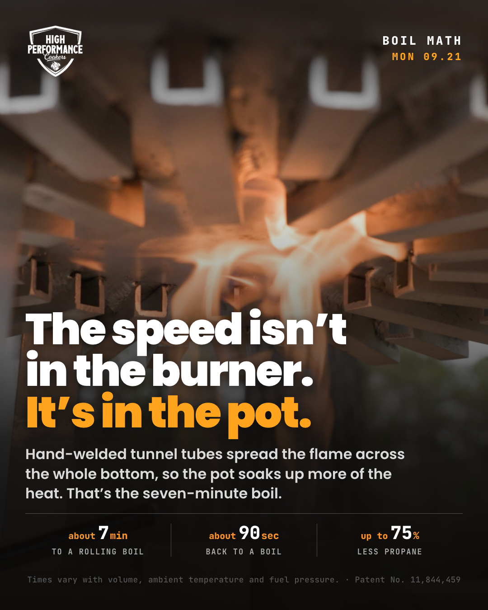
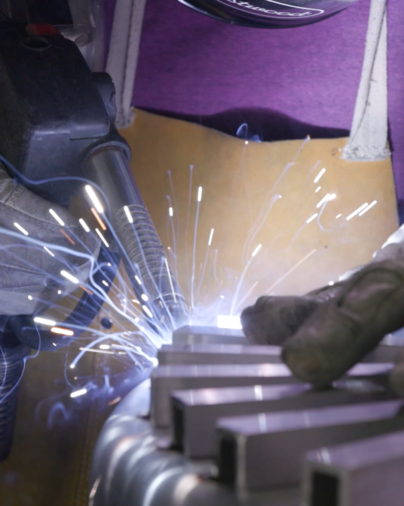
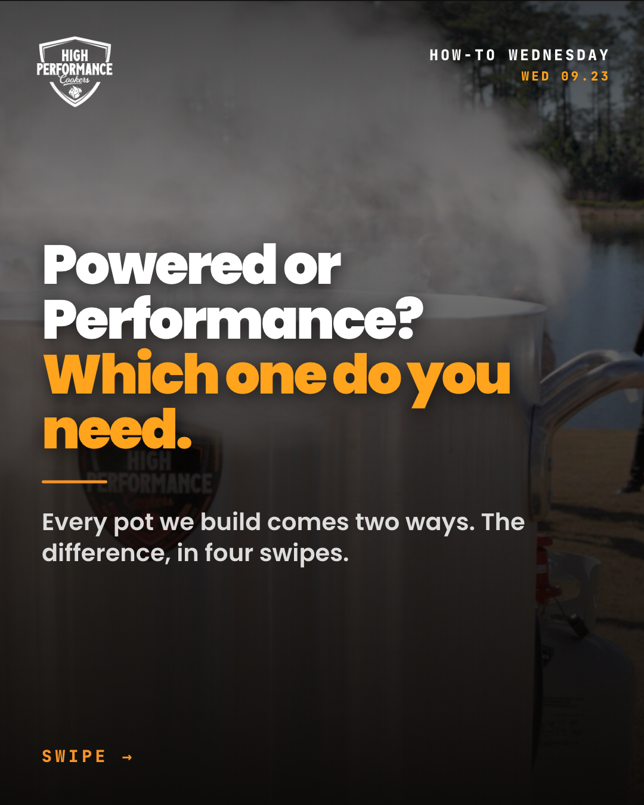
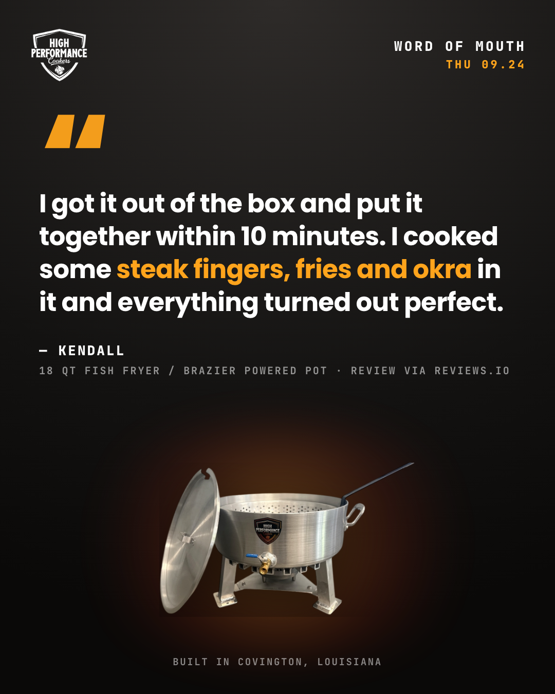
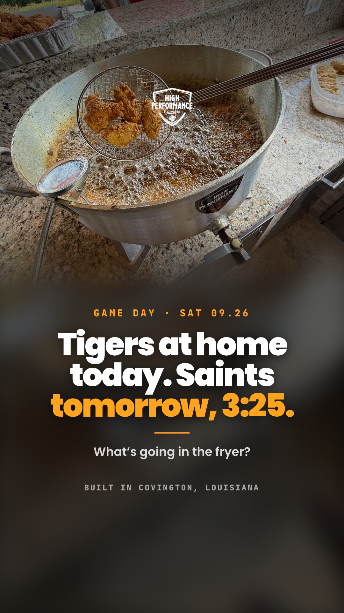

# Content week — Mon Sep 21 to Sun Sep 27, 2026

**Proposed:** Wed 2026-09-16, 10:50 CT (built as the first run of `/content-week`, ahead of the Monday task) · **Status:** **approved** — Evan, 2026-09-16, 11:05 CT in chat ("i like this first round, it is approved so go ahead and schedule it"), all six as proposed · **4 of 6 scheduled** in Business Suite, read back 2026-09-16 ~3:00 pm CT · Friday reel and Saturday story **not scheduled** (see the table at the bottom)
**Kit condition at scheduling time:** the Tailgate Kit is still a Shopify **draft** (board, Now #1), so every `[IF KIT LIVE]` line is **left out** of the scheduled captions and the **plain** Saturday story is scheduled. If the kit goes live before Thursday, edit the Thu/Fri captions and swap the Saturday story in the Planner.
**Season:** tailgate season open, October peak ahead, turkey content starts Oct 1 (`seasonal-calendar.md`).
**Carrying from the board:** the Garrett shoot is Tue Sept 22 at the shop (Tuesday's caption mentions the camera crew) · the **18 QT Tailgate Kit is due live Fri Sept 25 at $465** (Jay approved) **but is gated** — no kit goes live while `HIGH15`/`SMS25` are still active (Biljana switching flows). Every kit line below is marked `[IF KIT LIVE]` and comes out if it is not.
**Planner hint:** "This week, your Instagram followers are most active at 4:00 PM" (Business Suite Planner, for Fri Sept 18, read 2026-09-16). Slot times below are the standing format's starting times; revisit after four weeks.
**Baseline, for the record:** nothing has posted since Tue Sept 8 (Business Suite → Content, read 2026-09-16). Last organic reads there: Labor Day carousel Sept 2 — 391 reach · 10 interactions (FB); Jay's 18 QT reel Sept 2 — 573 reach · 30 interactions (IG); cookwithbill creator reel Aug 29 — 502 reach · 92 interactions. Platform-reported, small numbers, not a trend.

**Missing this week, and the fallback used:** no fresh shop photo yet → Shop Floor Tuesday runs the welder photo raw, and swaps if Evan sends a phone photo by Tue 3:00 pm. No new video until Garrett delivers → Friday Fire runs the library wings clip (7 s, native 9:16, 9.6 MB), which does not appear in Business Suite's 90-day published list, so it is treated as never posted. LSU kickoff time for Sept 26 was still TBA at tigerrag.com on 2026-09-16, so the story says "today," not a time.

---

## The week

| # | Day · time (CT) | Segment | Format | FB | IG | Piece | Status |
|---|---|---|---|---|---|---|---|
| 1 | Mon 21 · 12:00 | Boil Math Monday | graphic 4:5 | ✅ | ✅ | `01_MON-0921_FEED_boil-math-pot-not-burner.png` | scheduled ✔ |
| 2 | Tue 22 · 5:30 pm | Shop Floor Tuesday | raw photo 4:5 + story 9:16 | ✅ | ✅ | `02_TUE-0922_FEED_shop-floor-weld-RAW.png` · `02_TUE-0922_STORY_shop-floor-weld-RAW.png` | scheduled ✔ feed + story (swap the photo if a shoot-day one lands) |
| 3 | Wed 23 · 12:00 | How-To Wednesday | carousel ×6 | ✅ | ✅ | `03_WED-0923_CAROUSEL_1-cover.png` … `_6-cta.png` | scheduled ✔ · corrected 2026-09-16 (frame 3 + FB caption, 160 → 120 QT) |
| 4 | Thu 24 · 5:30 pm | Word of Mouth Thursday | review card 4:5 | ✅ | ✅ | `04_THU-0924_FEED_review-kendall-18qt.png` | scheduled ✔ |
| 5 | Fri 25 · 12:00 | Friday Fire | reel 9:16, 7 s, sound on | ✅ | ✅ | `05_FRI-0925_REEL_wings-18qt.MOV` | scheduled by Evan |
| 6 | Sat 26 · 9:00 am | Game Day | story 9:16 | ✅ | ✅ | `06_SAT-0926_STORY_game-day.png` — or `…_game-day-KIT.png` `[IF KIT LIVE]` | scheduled by Evan (plain version) |

Sunday dark. Pillar count: Proof 1½ · People 1½ · How 1 · Boil 2 · Offer 0 (or a passenger on 4, 5, 6 if the kit is live).

---

## Previews

### 1 · Mon Sep 21 · 12:00 · Boil Math Monday

**Visual:** the lit powered burner seen from underneath, flame through the tunnel tubes (`assets/lifestyle/pwd-burner-lit.png`). Headline "The speed isn't in the burner. It's in the pot." Spec strip: about 7 min to a rolling boil · about 90 sec back to a boil · up to 75% less propane. Legal line and patent number. Template `templates/cw-2026-09-21/mon-boilmath-4x5.html`.
**Caption — Facebook**
```
Boil Math Monday.

The speed isn't in the burner. It's in the pot.

Flip one of ours over and you'll see it: tunnel tubes, welded by hand across the bottom. The burner sits in the middle, and without them that heat hammers one spot. The tubes catch the flame and spread it over the whole base, so the pot soaks up a lot more of the heat it's given.

That's what gets you to a rolling boil in about 7 minutes, and back to a boil roughly 90 seconds after the next sack goes in. Same reason you burn up to 75% less propane doing it.

Already got a burner you like? Then you only need the pot. Our Performance pots carry the same tubes and run on whatever you've got.

Built and hand-welded in Covington, Louisiana. Patent No. 11,844,459.
```
**Caption — Instagram**
```
Boil Math Monday.

The speed isn't in the burner. It's in the pot. 🔥

Tunnel tubes, hand-welded across the bottom, spread the flame over the whole base so the pot soaks up more of the heat. Rolling boil in about 7 minutes. Back to a boil in roughly 90 seconds. Up to 75% less propane.

Already got a burner? You only need the pot.

#louisiana #crawfishboil #seafoodboil #outdoorcooking #builtinlouisiana #cajuncooking #highperformancecookers
```
**Why this one:** the series opens on the single most mis-stated fact about HPC, and it sets up Wednesday's Powered-vs-Performance carousel.
**Claims check:** "about 7 minutes," "roughly 90 seconds," "up to 75%" — all qualified (who-we-are proof points). Performance pot runs on any burner (what-we-sell, Tier 1A). Patent No. 11,844,459 (standing rules). "Hand-welded in Covington" — allowed wording; no "Made in USA." No price, no warranty line, no competitor.

### 2 · Tue Sep 22 · 5:30 pm · Shop Floor Tuesday

**Visual:** the welder photo, cropped 4:5, **raw — no type, no logo** (the format's one deliberate logo omission). Story repost `02_TUE-0922_STORY_shop-floor-weld-RAW.png` uses the blurred band so the landscape photo is not sliced. **Preferred swap:** one phone photo from the shoot morning (Garrett's setup, Stephen at the 60 QT, the crew) sent by Tue 3:00 pm — the scheduled post's media gets replaced, caption unchanged.
**Caption — Facebook**
```
Shop Floor Tuesday.

This is where the seven-minute boil actually comes from. Not a marketing department. A welder, a torch, and a stack of tubes going onto the bottom of a pot one at a time.

Every tunnel tube on every pot we sell gets welded by hand here in Covington, Louisiana, by a crew of about twelve who do everything else too: pack the freight, answer the phone, load the truck.

We've got a camera crew in the shop this week, so you'll be seeing more of these folks soon.

Tuesdays here are for the shop floor. Say hi.
```
**Caption — Instagram**
```
Shop Floor Tuesday.

Every tunnel tube, welded by hand, one at a time, in Covington, Louisiana. A crew of about twelve who do everything else too. 🔥

Camera crew's in the shop this week. More of these folks soon.

#builtinlouisiana #louisiana #outdoorcooking #crawfishboil #highperformancecookers
```
**Why this one:** the People pillar, and the trust asset ("a small team of 12 that do everything") on the day the shoot happens.
**Claims check:** "crew of about twelve" — Evan's wording (who-we-are, our-team). "Camera crew in the shop this week" — true only if the Sept 22 shoot holds; **confirm before approval.** No performance number in the caption beyond "seven-minute boil" as the name of the thing (the qualified figure ran Monday). No "we make the pots."

### 3 · Wed Sep 23 · 12:00 · How-To Wednesday — carousel, 6 frames in this order

1. `_1-cover` — steam photo, "Powered or Performance? Which one do you need." kicker HOW-TO WEDNESDAY · WED 09.23
2. `_2-same-tubes` — flame through the tubes, "Same tubes on both."
3. `_3-powered` — 120 QT Powered cutout, "Tubes and burner, welded as one." · rolling boil in about 7 min · up to 75% less propane · 18 QT to 120 QT *(was "160 QT", corrected by Evan 2026-09-16)*
4. `_4-performance` — 80 QT Performance cutout, "Tubes only. Bring your burner." · works on any burner · up to 75% less propane · 18 QT to 120 QT
5. `_5-which-one` — "Starting from scratch? Powered. Already got a burner? Performance."
6. `_6-cta` — basket-pour photo, "Still not sure? Comment how many people you feed and we'll tell you the pot."

Config `howto.json` (this folder) → `carousel.py` → `build-carousel.sh` → `check-centering.py`: worst offset 32 px, all four measured frames inside the ±50 target (run 2026-09-16).
**Caption — Facebook**
```
How-To Wednesday.

Powered or Performance? The question we get most, answered in six swipes.

Every pot we build comes two ways. Both have the same hand-welded tunnel tubes on the bottom, and the tubes are what make it fast.

POWERED: tubes and burner welded to the pot as one piece. The complete rig. Set it down, hook up the propane, cook. 18 QT to 120 QT.

PERFORMANCE: tubes only. It runs on the burner you already own, and it ships with the basket, the lid and the drain valve. 18 QT to 120 QT.

Starting from scratch? Powered. Already got a burner you trust? Performance. Either way the tubes are on the pot, and either way it burns up to 75% less propane doing it.

Still not sure which size? Comment how many people you usually feed and we'll tell you the pot.
```
**Caption — Instagram**
```
How-To Wednesday.

Powered or Performance? Swipe. →

Same hand-welded tunnel tubes on both. Powered = tubes + burner, one piece, the complete rig. Performance = tubes only, runs on the burner you already own (basket, lid and drain valve included).

Starting from scratch? Powered. Already got a burner? Performance.

Comment how many people you feed and we'll tell you the pot. 🔥

#crawfishboil #seafoodboil #louisiana #outdoorcooking #builtinlouisiana #cajuncooking #highperformancecookers
```
**Why this one:** the How pillar with the highest save value — it is the buyer's first real question, and it argues the Tier 1A Performance entry point without a discount.
**Claims check:** Powered/Performance definitions, "works on any burner," basket + lid + drain valve included (Evan, 2026-09-08), 18 QT Performance fryer exists — from `what-we-sell.md`. ❌ **Missed on first pass:** it also said Powered runs to 160 QT. The 160 QT is commercial; consumer pots top out at 120 QT (Evan, 2026-09-16). Frame 3 re-rendered and the Facebook caption corrected. The caption's "rolling boil in about 7 minutes" line was also dropped, since the range starts at the 18 QT fryer (boiling and frying claims never share a line). **Both scheduled posts edited in Business Suite 2026-09-16 on Evan's go**, read back still scheduled Wed Sep 23 12:00 PM with no 160 anywhere. No Triple Jet fitment line (would need "60 QT and up"). No prices. Frame 3 says "about 7 min," frames 3–4 "up to 75%." Comment CTA replaces an offer.

### 4 · Thu Sep 24 · 5:30 pm · Word of Mouth Thursday

**Visual:** review card on charcoal — Kendall's words, name and product, "review via reviews.io," the 18 QT Powered cutout below (nudged 18 px right for the leaning lid). Template `templates/cw-2026-09-21/thu-review-4x5.html`.
**Caption — Facebook**
```
Word of Mouth Thursday.

"Everything was great with the cooker. I got it out of the box and put it together within 10 minutes. I cooked some steak fingers, fries and okra in it and everything turned out perfect."
— Kendall, 18 QT Fish Fryer / Brazier Powered Pot

Steak fingers, fries and okra. Nobody told Kendall it was a fish fryer, and that's exactly the point. The 18 QT gets the oil to 350° in under 5 minutes and holds it there, so whatever goes in comes out the same every time.

Thanks, Kendall. Reviews like this are the whole reason we build them here.

[IF KIT LIVE] Tomorrow the 18 QT Tailgate Kit goes live: fryer, leg extensions, thermometer, wind shield, skimmer. One box, ready for Saturday.
```
**Caption — Instagram**
```
Word of Mouth Thursday.

"I cooked some steak fingers, fries and okra in it and everything turned out perfect." — Kendall, 18 QT Fish Fryer

Nobody told Kendall it was a fish fryer. That's the point. 350° in under 5 minutes, and it holds there. 🔥

[IF KIT LIVE] Tomorrow: the 18 QT Tailgate Kit goes live.

#fishfry #tailgate #louisiana #outdoorcooking #builtinlouisiana #highperformancecookers
```
**Why this one:** Proof from a customer, on the off-season workhorse (18 QT is the #2 SKU for the year), the day before the kit launches.
**Claims check:** quote is verbatim from `customer-language.md` (reviews.io, pulled 2026-08-26); the graphic trims the first sentence with nothing reworded. "350° in under 5 minutes" is the documented frying stat for the 18 QT / 4-Way / 40 QT only (what-we-sell). No star rating shown (not on file). Kit contents as on the board; **check the live kit page before the tail runs.** Fryer, no crawfish anywhere near it.

### 5 · Fri Sep 25 · 12:00 · Friday Fire — reel
**Visual:** `05_FRI-0925_REEL_wings-18qt.MOV` — wings frying in the 18 QT, thermometer clipped to the rim, 1080×1920, 7 s, H.264 with audio, 9.6 MB (uploads through the browser tool). Post with sound on; pick a cover frame with the thermometer visible.
**Caption — Facebook**
```
Friday Fire.

Wings in the 18 QT. Sound on.

Watch the thermometer clipped to the rim, because that's the whole trick to frying outside: get the oil to 350° and hold it there. The tunnel tubes on the bottom of this pot get it there in under 5 minutes and bring it right back after every basket.

Fish, wings, fries, hushpuppies, soft-shell crab. Same pot, all fall.

What's going in the fryer this weekend?

[IF KIT LIVE] The 18 QT Tailgate Kit is live today: fryer, leg extensions, thermometer, wind shield, skimmer. $465 at highperformancecookers.com.
```
**Caption — Instagram**
```
Friday Fire. 🔥

Wings in the 18 QT. Sound on. Watch the thermometer: 350°, hold it there. The tunnel tubes get it there in under 5 minutes and bring it right back after every basket.

What's going in the fryer this weekend?

[IF KIT LIVE] The 18 QT Tailgate Kit is live. Link in bio.

#fishfry #tailgate #gameday #louisiana #outdoorcooking #builtinlouisiana #highperformancecookers
```
**Why this one:** the only native-vertical video on file, and it is the right product on kit-launch day. From Oct 2 the Friday slot runs Garrett's footage.
**Claims check:** "in under 5 minutes" — 18 QT frying stat. Fried-food list is the documented one (fish, wings, fries, hushpuppies, soft-shell crab). $465 is Jay's approved kit price (board, Now #1) — **only if the kit is live and the price on the live page reads $465.** No crawfish.

### 6 · Sat Sep 26 · 9:00 am · Game Day — story

**Visual:** wings-in-the-fryer photo up top, "Tigers at home today. Saints tomorrow, 3:25." · "What's going in the fryer?" Type inside the story safe zones. **Kit variant** `06_SAT-0926_STORY_game-day-KIT.png` adds the badge "18 QT TAILGATE KIT · NOW LIVE," the five contents and "$465 · link in bio." Stories carry no caption. If Evan wants a poll sticker ("Wings or fish?") he adds it by hand — Business Suite cannot schedule stickers.
**Why this one:** first game-day story of the format; LSU hosts Texas A&M Sat Sept 26 (kickoff TBA — tigerrag.com, read 2026-09-16); Saints host the Raiders Sun Sept 27 at 3:25 pm CT (neworleanssaints.com, read 2026-09-16).
**Claims check:** fixtures sourced above; team names in text only, no logos, brand colors (Evan's shoot rule, applied to organic). Kit variant only `[IF KIT LIVE]`; price as on the board, to be re-read on the live page Saturday morning.

---

## Needs from Evan

- **Confirm the shoot is still Tue Sept 22** — Tuesday's caption says a camera crew is in the shop this week.
- **One phone photo from the shop by Tue 3:00 pm** to replace the welder photo on Shop Floor Tuesday. If none comes, the welder photo runs as scheduled.
- **Kit status by Thu 12:00:** is the 18 QT Tailgate Kit live (Biljana's flows switched, `HIGH15`/`SMS25` off)? That decides the `[IF KIT LIVE]` lines on 4 and 5 and which Saturday story runs. Default if unknown: the lines come out and the plain story runs.
- **The wings clip:** it is not in Business Suite's 90-day published list, so it is treated as never posted. Say if that is wrong and Friday swaps to a raw Boil photo.
- **Reply `approved` to schedule all six, or give line notes by number.** Scheduling happens in Business Suite only after that reply, one piece at a time, then read back in the Planner.

---

## After approval — filled in by the skill

| # | Scheduled for (CT) | Read back | Notes |
|---|---|---|---|
| 1 | Mon Sep 21, 12:00 PM · Facebook + Instagram | ✔ Content → Scheduled lists both, 2026-09-16 ~3:00 pm | |
| 2 | Tue Sep 22, 5:30 PM · feed on Facebook + Instagram · story on Facebook + Instagram | ✔ feed: Scheduled list, both · ✔ story: Planner shows two more 5:30 PM items that day | Share-to-Facebook-Story switched off on every feed post (the separate story covers it) |
| 3 | Wed Sep 23, 12:00 PM · Facebook + Instagram · 6 frames | ✔ Scheduled list, both · Instagram preview showed the cover as frame 1 | |
| 4 | Thu Sep 24, 5:30 PM · Facebook + Instagram | ✔ Scheduled list, both | Kit lines left out (kit still a draft) |
| 5 | Fri Sep 25, 12:00 PM · scheduled **by Evan**, 2026-09-16 (his word, not read back) | — | The `.MOV` sat on "Processing media" for 4+ minutes with no error. **Evan:** upload `05_FRI-0925_REEL_wings-18qt.MOV` for Fri Sep 25, 12:00 PM with the captions above, or re-export as MP4 and Atlas retries. |
| 6 | Sat Sep 26, 9:00 AM · scheduled **by Evan**, 2026-09-16 (his word, not read back) | — | The story composer's date picker failed twice; stopped under the two-strikes rule. **Evan:** schedule `06_SAT-0926_STORY_game-day.png` as a story on both, Sat Sep 26, 9:00 AM. |

**Active times Business Suite suggested** (read 2026-09-16, Schedule panel): Facebook Sun 9/20, Mon 9/21, Tue 9/22 at 8:00 PM · Instagram Thu 9/17 8:00 PM, Fri 9/18 4:00 PM, Wed 9/23 9:00 AM. Evenings lead on both. One data point; revisit slot times after four weeks as rule 6 says.
