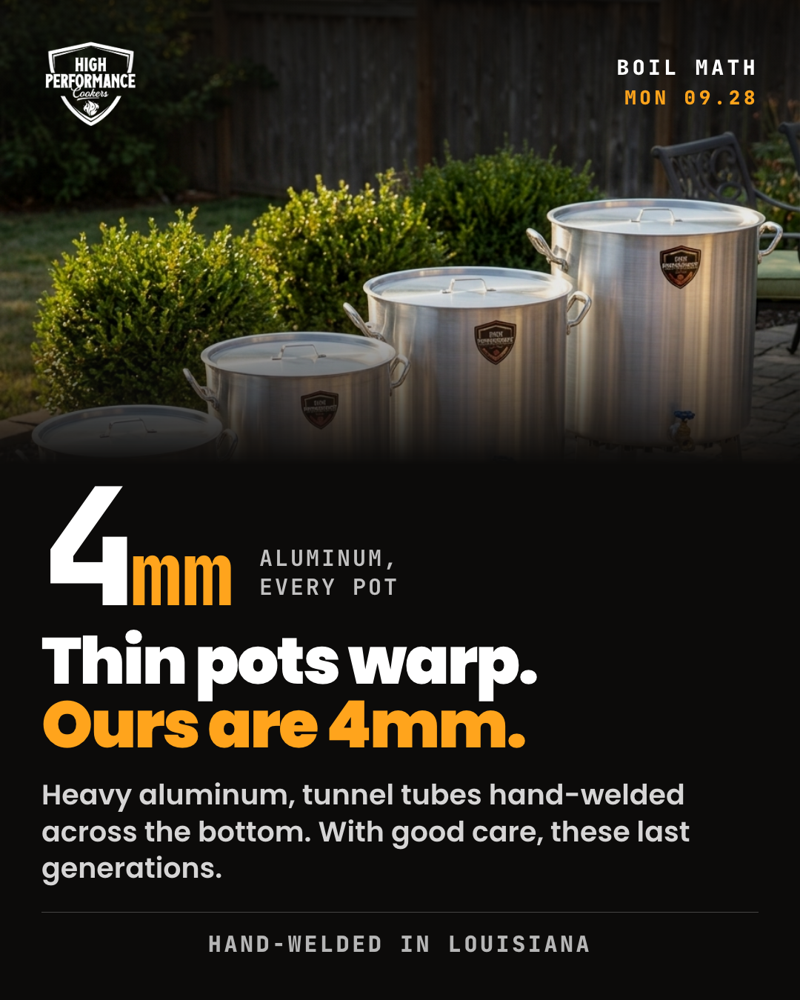
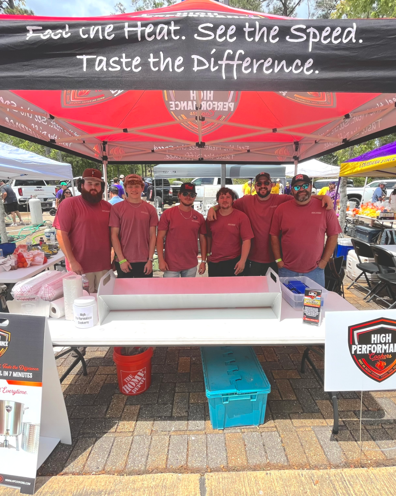
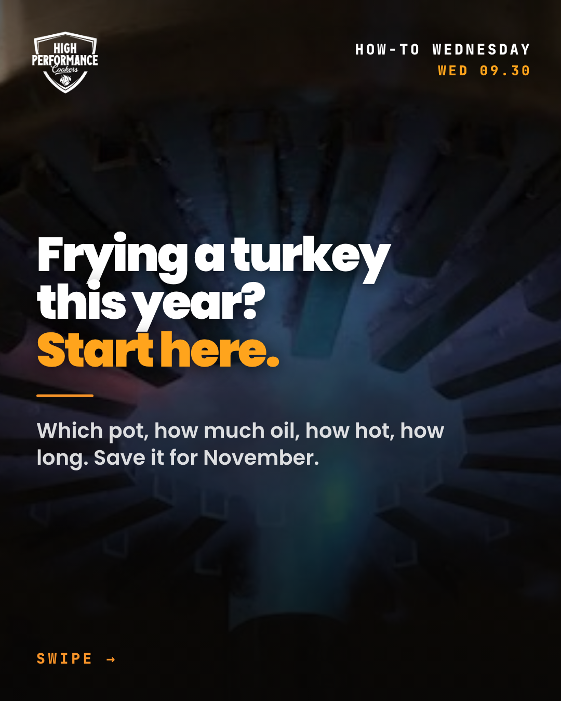
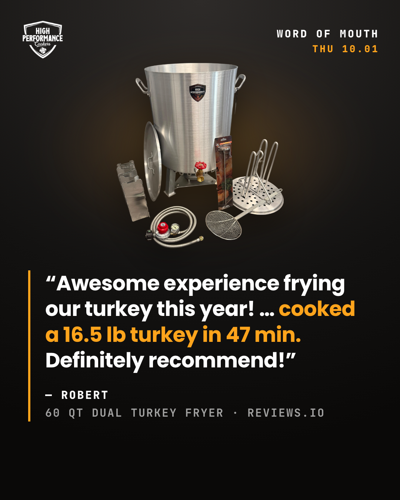
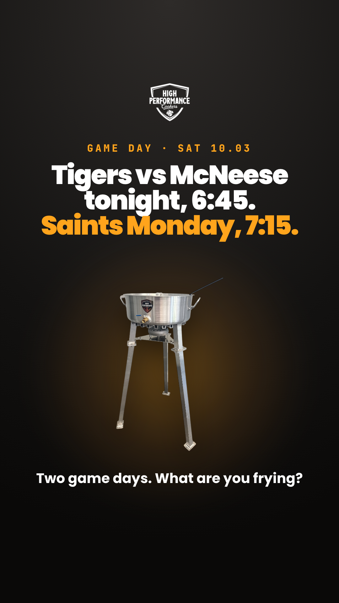

# Content week — Mon Sep 28 to Sun Oct 4, 2026

**Proposed:** Mon 2026-09-21 CT, built a week early on Evan's ask ("preview next week's content") · **Status:** preview. Evan reviewed it 2026-09-21. **Final approval waits until after the Sept 23 shoot**: Evan shoots photos and video all day, ROUX sorts them and upgrades these pieces, then Evan approves and it gets scheduled
**Season:** October is peak tailgating, and turkey content starts Oct 1 (`seasonal-calendar.md`). October is also National Seafood Month (fall-moments calendar).
**Carrying from the board:** the **Turkey Fry Kits go live Wed Oct 1** (go/no-go Sept 30) and the **18 QT Tailgate Kit is due live Fri Sept 25**. Both are gated on `HIGH15` being off (Biljana). **Per the plan, both kits are live by these posts, so the kit lines run by default** (Evan, 2026-09-21). A kit line comes out only if its go/no-go (Thu Sept 24 tailgate, Wed Sept 30 turkey) says no. The Garrett shoot is **Wed Sept 23**, so this is the first week that can carry shoot footage and photos.
**Planner hint:** not read. Business Suite → Content → Scheduled, read 2026-09-21: **nothing is scheduled after Fri Sep 25** (the six Sept 21–26 items are all there), so no clashes.

**Missing this week, and the fallback used:**
- **No new video yet.** Friday Fire depends on Garrett's 30 QT turkey demo or Evan's phone clips from the Sept 23 shoot. If neither arrives by Thu Oct 1 noon, **Friday is dropped** rather than re-running last week's wings clip or recycling a photo from two weeks ago (rule 9).
- **No shop photo yet.** Tuesday is built on the team cook-off booth photo (Apr 2026) as the fallback. A shoot-day phone photo from Sept 23 replaces it if Evan sends one.

---

## The week

| # | Day · time (CT) | Segment | Format | FB | IG | Piece | Status |
|---|---|---|---|---|---|---|---|
| 1 | Mon 28 · 12:00 | Boil Math Monday | graphic 4:5 | ✅ | ✅ | `01_MON-0928_FEED_boil-math-4mm.png` | proposed |
| 2 | Tue 29 · 5:30 pm | Shop Floor Tuesday | raw photo 4:5 + story | ✅ | ✅ | `02_TUE-0929_FEED_shop-floor-crew-RAW.png` · `02_TUE-0929_STORY_shop-floor-crew-RAW.png` | proposed (swap if a shoot photo comes) |
| 3 | Wed 30 · 12:00 | How-To Wednesday | carousel ×7 | ✅ | ✅ | `03_WED-0930_CAROUSEL_1-cover.png` … `_7-cta.png` | proposed |
| 4 | Thu Oct 1 · 5:30 pm | Word of Mouth Thursday | review card 4:5 | ✅ | ✅ | `04_THU-1001_FEED_review-robert-60qt-turkey.png` | proposed |
| 5 | Fri Oct 2 · 12:00 | Friday Fire | reel 9:16 | ✅ | ✅ | `05_FRI-1002_REEL_turkey-30qt.mp4`, not yet delivered | **conditional:** dropped if no footage by Thu noon |
| 6 | Sat Oct 3 · 9:00 am | Game Day | story 9:16 | ✅ | ✅ | `06_SAT-1003_STORY_game-day-KIT.png` (default; the plain version is the backup) | proposed |

Sunday dark. Pillars: Proof 1½ (Mon, Thu) · People 1 (Tue) · How 1 (Wed) · Boil 1–2 (Fri, Sat) · Offer 0–1 (passengers on 4 and 6 only). Turkey runs Wed → Thu → Fri to set up the Oct 1 kit launch. It is not in Monday's or Tuesday's posts, because those two never sell.

---

## Previews

### 1 · Mon Sep 28 · 12:00 · Boil Math Monday
```schedule
{
 "id": "1-feed",
 "type": "feed",
 "placements": [
  "facebook",
  "instagram"
 ],
 "date": "2026-09-28",
 "time": "12:00",
 "media": [
  "01_MON-0928_FEED_boil-math-4mm.png"
 ],
 "graphicText": [
  "4mm",
  "Thin pots warp. Ours are 4mm.",
  "Hand-welded in Louisiana."
 ]
}
```

**Visual:** the four-pot Powered lineup on a patio (`assets/lifestyle/hf_20260716_…png`), faded into charcoal. Big "4mm" stat, headline "Thin pots warp. Ours are 4mm." Foot line "Hand-welded in Louisiana." Shield logo; no patent number written anywhere. Template `templates/cw-2026-09-28/mon-boilmath-4x5.html`. This is a new layout: a photo band over a stat, unlike last Monday's full-bleed photo with a spec strip.
**Caption — Facebook**
```
Boil Math Monday.

One number today: 4mm.

That's how thick the aluminum is on every pot we build. Thin pots warp. Ours are 4mm, with the tunnel tubes hand-welded across the bottom here in Louisiana.

It's the same call as the cheap ice chest you replace every couple of summers versus the good one you keep. Take care of one of these and your kids will boil in it.
```
**Caption — Instagram**
```
Boil Math Monday.

4mm aluminum on every pot we build. Thin pots warp. Ours get handed down. 🔥

Take care of it and your kids will boil in it.

#louisiana #seafoodboil #outdoorcooking #builtinlouisiana #cajuncooking #highperformancecookers
```
**Why this one:** the Monday bank has two angles that haven't run: 4mm and crowd math. Crowd math is about crawfish sacks, which reads off-season in October and duplicates the live IW ad. 4mm is Proof that argues quality instead of price, which is why 80% of buyers choose HPC (reviews.io survey, customer-language.md).
**Claims check:** "4mm aluminum", never "cast" (standing rules). "With good care, these last generations" is Evan's register (how-we-sound); no specific lifespan is claimed. The ice-chest idea is used without naming the brand. No warranty (four pots in frame), no price, no time claim, so no legal line. "Hand-welded in Louisiana", not "Made in USA."

### 2 · Tue Sep 29 · 5:30 pm · Shop Floor Tuesday
```schedule
{
 "id": "2-feed",
 "type": "feed",
 "placements": [
  "facebook",
  "instagram"
 ],
 "date": "2026-09-29",
 "time": "17:30",
 "media": [
  "02_TUE-0929_FEED_shop-floor-crew-RAW.png"
 ],
 "notes": [
  "Fallback photo (team cook-off booth, Apr 2026). If a Sept 23 shoot photo replaces it, the media AND the caption change (swap caption is in PLAN.md): update PLAN.md, rebuild, and Evan approves the new version."
 ]
}
```
```schedule
{
 "id": "2-story",
 "type": "story",
 "placements": [
  "facebook",
  "instagram"
 ],
 "date": "2026-09-29",
 "time": "17:30",
 "media": [
  "02_TUE-0929_STORY_shop-floor-crew-RAW.png"
 ],
 "notes": [
  "Story repost of the Tuesday photo, blurred band. Swaps with the feed photo."
 ]
}
```

**Visual:** the team cook-off booth photo (Apr 2026, six of the krewe in red shirts, all HPC employees (Evan, 2026-09-21) under the HPC tent). **Raw: no type, no logo.** The story repost `02_TUE-0929_STORY_shop-floor-crew-RAW.png` uses the blurred band. **Preferred swap:** a phone photo from the Sept 23 shoot (the crew, a pot on the bench, Garrett's lights). The scheduled post's media gets replaced, and so does the caption (swap version below).
**Caption — Facebook (fallback photo)**
```
Shop Floor Tuesday.

Off the shop floor for this one. That's part of our krewe at a crawfish cook-off this spring, tent up, table ready.

We're a krewe of about twelve in Covington, Louisiana. The same people who weld the tunnel tubes also pack your freight, answer the phone and show up at the cook-offs.

Last week a camera crew spent a day in the shop with us. You'll see what they caught soon.
```
**Caption — Instagram (fallback photo)**
```
Shop Floor Tuesday.

Part of the krewe, cook-off season. About twelve of us in Covington, Louisiana, doing everything from the welds to the phones. 🔥

Camera crew was in the shop last week. More soon.

#builtinlouisiana #louisiana #outdoorcooking #cajuncooking #highperformancecookers
```
**Swap caption, if a Sept 23 shoot photo comes in (FB; IG trims the same way)**
```
Shop Floor Tuesday.

Last Wednesday a camera crew spent the day in our Covington shop. This is what it looked like from our side of the lights.

We're a krewe of about twelve. The same people who weld the tunnel tubes also pack your freight and answer the phone. Now you'll get to see them work. Videos coming soon.
```
**Why this one:** People pillar. It is the first Tuesday after the shoot, and the payoff to last Tuesday's "more of these folks soon."
**Claims check:** "about twelve" is Evan's wording (who-we-are); "krewe" for our own people (Evan, 2026-09-21). "Camera crew" stays "crew", since that's Garrett's team. Everyone in the booth photo is an HPC employee (Evan, 2026-09-21). Nobody is named (no permission on file). The shoot date (Sept 23) is from the board. Nothing sells on Tuesday.

### 3 · Wed Sep 30 · 12:00 · How-To Wednesday: carousel, 7 frames in this order
```schedule
{
 "id": "3-carousel",
 "type": "carousel",
 "placements": [
  "facebook",
  "instagram"
 ],
 "date": "2026-09-30",
 "time": "12:00",
 "media": [
  "03_WED-0930_CAROUSEL_1-cover.png",
  "03_WED-0930_CAROUSEL_2-one-bird.png",
  "03_WED-0930_CAROUSEL_3-two-birds.png",
  "03_WED-0930_CAROUSEL_4-measure-oil.png",
  "03_WED-0930_CAROUSEL_5-prep-bird.png",
  "03_WED-0930_CAROUSEL_6-temp-time.png",
  "03_WED-0930_CAROUSEL_7-cta.png"
 ],
 "graphicTextFrom": "howto.json"
}
```

1. `_1-cover`: flame under the tunnel tubes. "Frying a turkey this year? **Start here.**" "Which pot, how much oil, how hot, how long. Save it for November."
2. `_2-one-bird`: 30 QT Turkey Fryer Powered with the single rack. "One turkey? The 30 QT." · 350° in under 10 min · 12″ thermometer fits
3. `_3-two-birds`: 60 QT Dual Turkey Fryer with the dual rack. "Feeding a crowd? The 60 QT." · dual rack · 12″ thermometer fits
4. `_4-measure-oil`: Step 1. "Measure your oil with water." Bird in the empty pot, water to cover, take the bird out, and that line is your oil line. Dump the water and dry the pot.
5. `_5-prep-bird`: Step 2. "Fully thawed. Patted dry. Not stuffed." USDA says 12 lb or less.
6. `_6-temp-time`: Step 3. "350°. About 3 to 5 minutes a pound." Done at 165° in the thickest part of the breast and the innermost thigh and wing. Source: USDA.
7. `_7-cta`: oil frying in the 18 QT. "Save this for Thanksgiving." Comment for questions. "Hand-welded in Louisiana · Most orders ship in 1–2 business days."

Config `howto.json` (this folder). `check-centering.py`: worst offset 28 px, and all five measured frames are inside ±50. `carousel.py` type sizes were raised to the rule-7 floors on this use (sub 36, stats 30, tag 30), as decided 2026-09-16.
**Caption — Facebook**
```
How-To Wednesday.

Frying a turkey this year? Save this one for November.

ONE BIRD: the 30 QT Turkey Fryer and its single upright rack.
TWO BIRDS: the 60 QT Dual Turkey Fryer and its dual rack. Two turkeys at once.

Step 1, before any oil: measure with water. Set the bird in the empty pot and add water until it's covered. Take the bird out. That water line is how much oil you need. Dump the water and dry the pot all the way.

Step 2, the bird: fully thawed, patted dry, not stuffed. USDA's guidance is 12 pounds or less for frying.

Step 3, heat and time: oil at 350°, about 3 to 5 minutes a pound. It's done at 165° in the thickest part of the breast and the innermost thigh and wing. Clip the 12" thermometer to the rim and keep an eye on it.

Cooking figures are USDA guidance. Questions about your setup? Comment and we'll answer.
```
**Caption — Instagram**
```
How-To Wednesday.

Frying a turkey this year? Swipe, then save it for November. →

One bird: 30 QT. Two birds: 60 QT Dual.
Measure your oil with water first. Thawed, dry, not stuffed. 350°, about 3 to 5 minutes a pound, done at 165°. (USDA guidance.)

Questions? Drop them below. 🔥

#turkeyfry #louisiana #outdoorcooking #cajuncooking #builtinlouisiana #highperformancecookers
```
**Why this one:** "Turkey fry, step by step" is in the How bank for October–November. It runs the day before the Turkey Fry Kits launch, and it's the most save-worthy post of the fall. It stays a how-to with no kit pitch and no price; the kit rides Thursday.
**Claims check:** rack fitment is from what-we-sell (single upright for the 30 QT, dual for the 60 QT). The 12″ thermometer fits the 30 QT and the 60 QT Dual (Evan, 2026-09-11 and 2026-09-16). "350° in under 10 minutes" is the frying figure for every pot outside the 18 QT, 4-Way and 40 QT (what-we-sell), so it's on the 30 QT frame only. **Cooking figures are USDA FSIS, "Deep Fat Frying and Food Safety"**, read by Scout 2026-09-21 from a government-hosted copy (the FSIS page blocked automated reads): 350°F · "approximately 3 to 5 minutes per pound" · 165°F at the thigh, wing and breast · "completely thawed", not stuffed, "12 pounds or less" · water-displacement oil measure. "Pat dry … prevent oil splatter" is USDA's general frying line, not turkey-specific. ⚠️ **"Dump the water and dry the pot" is common-sense safety that Scout did not source.** Say if you'd rather cut it. No crawfish, no prices, no warranty.

### 4 · Thu Oct 1 · 5:30 pm · Word of Mouth Thursday
```schedule
{
 "id": "4-feed",
 "type": "feed",
 "placements": [
  "facebook",
  "instagram"
 ],
 "date": "2026-10-01",
 "time": "17:30",
 "media": [
  "04_THU-1001_FEED_review-robert-60qt-turkey.png"
 ],
 "notes": [
  "Turkey kit tail runs by default (plan has the kits live Oct 1). It comes out only if the Sept 30 go/no-go says no: edit PLAN.md, rebuild, re-approve."
 ]
}
```

**Visual:** the Turkey Fry Kit (60 QT Dual) laid out, over Robert's words, with a gold rule and "60 QT DUAL TURKEY FRYER · REVIEWS.IO." The layout puts the product on top and the quote below, the reverse of last week's card. Centering measured 0 px.
**Caption — Facebook**
```
Word of Mouth Thursday.

"Awesome experience frying our turkey this year! … cooked a 16.5 lb turkey in 47 min. Definitely recommend!"
— Robert, 60 QT Dual Turkey Fryer

Thanksgiving's about eight weeks out. If you're thinking about frying one this year, Robert's already done the homework.

Thanks, Robert.

The Turkey Fry Kits are live today. The 30 QT kit comes with the rack, a 12" thermometer, a wind shield and a skimmer, for one bird. The 60 QT Dual kit does the same for two. At highperformancecookers.com.
```
**Caption — Instagram**
```
Word of Mouth Thursday.

"Awesome experience frying our turkey this year! … cooked a 16.5 lb turkey in 47 min. Definitely recommend!" — Robert, 60 QT Dual Turkey Fryer

The Turkey Fry Kits are live. Link in bio. 🔥

#turkeyfry #louisiana #outdoorcooking #builtinlouisiana #highperformancecookers
```
**Why this one:** Evan's pick (2026-09-21, over SamTC). It's a turkey customer's proof on the day the turkey kits launch.
**Claims check:** verbatim from reviews.io: Robert, 60 Qt Dual Turkey Fryer Pot, 2023-11-26 (Scout, 2026-09-21; the star came from the data feed, not the page, so none is shown). ⚠️ **Trimmed with "…": the dropped words are "Fast heating time (35-40 min)"**, since 35–40 minutes to heat reads against our "350° in under 10 minutes" line. Nothing is reworded. ⚠️ The 16.5 lb bird is over USDA's 12 lb guidance on Wednesday's frame 5; Evan chose this review knowing that (2026-09-21). Kit contents are from what-we-sell. No price in the tail. The kit line runs by default because the plan has the turkey kits live Oct 1; it comes out only if the Sept 30 go/no-go says no.

### 5 · Fri Oct 2 · 12:00 · Friday Fire (conditional)
```schedule
{
 "id": "5-reel",
 "type": "reel",
 "placements": [
  "facebook",
  "instagram"
 ],
 "date": "2026-10-02",
 "time": "12:00",
 "media": [
  "05_FRI-1002_REEL_turkey-30qt.mp4"
 ],
 "conditional": "Footage not delivered yet. No footage by Thu Oct 1 noon → mark dropped and the week runs five.",
 "notes": [
  "Captions are drafts; re-read every line against the clip before approval.",
  "Over 10 MB is Evan's upload."
 ]
}
```
**Visual:** Garrett's 30 QT turkey demo cut to 9:16, under 30 s, with the bird going in and the thermometer in frame. **Or** Evan's phone clip from the Sept 23 shoot. Over 10 MB is Evan's upload. **No footage by Thu Oct 1 noon → dropped, and the week runs five.**
**Caption — Facebook (draft; checked against the clip before scheduling)**
```
Friday Fire.

Turkey going into 350° oil in the 30 QT. Sound on.

Watch the thermometer. The bird goes in, the oil dips, and the tunnel tubes on the bottom of the pot pull it right back up.

Who's frying this year?

The Turkey Fry Kits are live at highperformancecookers.com.
```
**Caption — Instagram**
```
Friday Fire. 🔥

Turkey into 350° oil, 30 QT. Sound on. Watch it dip and come right back.

Who's frying this year?

#turkeyfry #outdoorcooking #louisiana #builtinlouisiana #highperformancecookers
```
**Why this one:** Friday is the Boil pillar, and the shoot's first priority video is the turkey demo.
**Claims check:** no time figure unless the clip shows the clock. Every line is re-read against what the footage actually shows.

### 6 · Sat Oct 3 · 9:00 am · Game Day story
```schedule
{
 "id": "6-story",
 "type": "story",
 "placements": [
  "facebook",
  "instagram"
 ],
 "date": "2026-10-03",
 "time": "09:00",
 "media": [
  "06_SAT-1003_STORY_game-day-KIT.png"
 ],
 "graphicText": [
  "Tigers vs McNeese tonight, 6:45.",
  "Saints Monday, 7:15.",
  "Two game days. What are you frying?",
  "18 QT TAILGATE KIT · FROM $404 · LINK IN BIO"
 ],
 "alternates": [
  {
   "label": "plain (no kit) — runs if the Sept 24 tailgate go/no-go says no",
   "media": [
    "06_SAT-1003_STORY_game-day.png"
   ]
  }
 ],
 "notes": [
  "KIT variant is the default (plan has the tailgate kit live Sept 25). Re-read the live kit price Saturday morning.",
  "A poll sticker, if Evan wants one, is added by hand: Business Suite cannot schedule stickers."
 ]
}
```

**Visual:** the 18 QT on leg extensions under a gold glow. "Tigers vs McNeese tonight, 6:45. **Saints Monday, 7:15.**" · "Two game days. What are you frying?" Type sits inside the story safe zones. Centering measured at 36 px. **KIT variant** `06_SAT-1003_STORY_game-day-KIT.png` adds "18 QT TAILGATE KIT · FROM $404 · LINK IN BIO." Stories carry no caption. A poll sticker, if you want one, is added by hand.
**Why this one:** LSU is at home Saturday night, and the Saints play their only primetime game Monday.
**Claims check:** LSU vs McNeese, Sat Oct 3, 6:45 pm CT, SEC Network: lsusports.net and ESPN (7:45 ET), Scout 2026-09-21. Saints vs Falcons, Mon Oct 5, 7:15 pm CT, ESPN: neworleanssaints.com and ESPN, Scout 2026-09-21. "Family Weekend" has only one source, so it's left off. Team names only, no logos. Fryer, no crawfish. The KIT price was $404–$455 when read 2026-09-21. Re-read the live page Saturday morning.

---

## Needs from Evan

- **Everything from the Sept 23 shoot** (Evan is shooting photos and video all day): ROUX sorts it, then upgrades Tuesday, Friday and anything else that improves. If no shoot photo fits Tuesday, the booth photo runs (all HPC employees, Evan confirmed).
- **Friday's footage:** Garrett's turkey demo, or your phone clip, by **Thu Oct 1 at noon**. If nothing arrives, Friday is dropped.
- **Kits:** they run by default, per the plan (tailgate live Sept 25, turkey Oct 1). A kit line comes out only if a go/no-go says no.
- ~~Wednesday frame 4~~: kept as is (Evan, 2026-09-21).
- **Reply `approved` to schedule all of these, or give line notes by number (e.g. "3: swap frame 4").** Scheduling happens in Business Suite only after that reply, one piece at a time, then read back.

---

## After approval — filled in by the skill

| # | Scheduled for (CT) | Read back in Planner | Notes |
|---|---|---|---|
| 1 | | | |
| 2 | | | |
| 3 | | | |
| 4 | | | |
| 5 | | | |
| 6 | | | |
